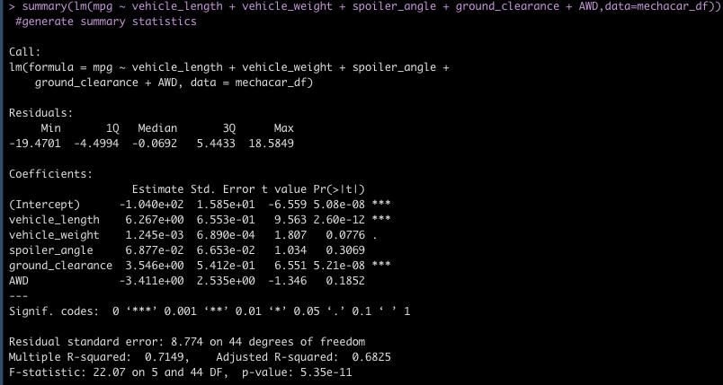
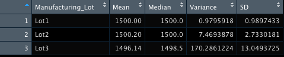
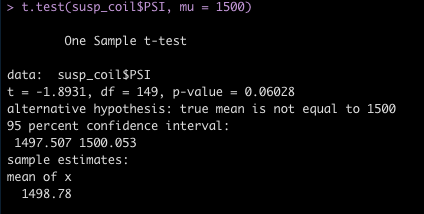
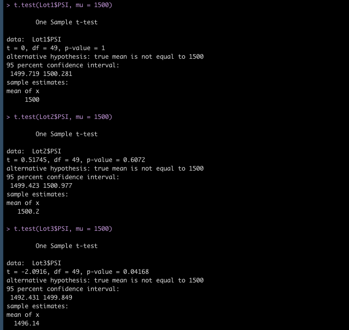

# MechaCar_Statistical_Analysis

## Linear Regression to Predict MPG

- The vehicle length, ground-clearance and intercept provided a non-random amount of variance to the mpg values in the dataset. 
- Due to the extremely small p-value, we are able to reject the null hypothesis for linear regression, which would state that the slope is equal to 0. At an alpha level of 0.05, we are able to reject the null hypothesis given that our p-value is 5.35e-11. Thus, we are able to assume that the alternative hypothesis (that the slope does not equal zero) is mostl likely true.
- The adjusted R-squared value of 0.6825 would conclude that the linear model predicts the mpg of MechaCar protoypes fairly effectively. The multiple R-Squared value is relatively high due to the amount of variables, but adjusted R-Squared value controls for the extra variables and does not produce a significant decrease. 

## Summary Statistics on Suspension Coils

Based on the summary statistics for our total_summary chart, the varaince of the suspension coils does not exceed 100 pounds per square inch, thus meeting the design specification for all manufacturing lots. However, when this data is separated by lot, the third lot has a significantly higher variance than Lots 1 & 2, and exceeds the variance of 100 pounds per square inch by over 70 pounds. With this variance, the third lot may not meet the necessary design specifications.

## T-Tests on Suspension Coils

For a t-test on the total lots, we would fail to reject our null hypothesis at a significance level of 0.05. The p-value for this t-test is 0.06. 

When separating the data by lots we would also fail to reject our null hypothesis for both Lots 1 and 2. Our p-values for these lots equal 1 and 0.6072. However, we can reject our null hypothesis for Lot 3 given that the p-value is 0.04168. The mean of the Lot 3 sample is also significantly smaller than the means for Lots 1 & 2. Additionally, the confidence interval for Lot 3 does not include the population mean of 1500. 

## Study Design: MechaCar vs Competition
Another useful statistical study for the MechaCar could be to analyze how certain variables affect the safety rating of the car. For families that want to purchase a vehicle, safety can often be the most crucial factor. In this study, we can perform a linear regression on how these various factors correlate with the safety rating for a car. This will help MechaCar determine which variables are most important in releasing a safe car. We can include the following metrics in this analysis: 
  - Dependent Variable: Safety Rating
  - Independent Variables: Vehicle length, vehicle weight, spoiler angle
  - Null Hypothesis: The vehicle safety rating is not affected by differences in vehicle length, weight or spoiler angle. 
  - We will need to collect data for the safety ratings on different makes/models of cars in order to see if these independent variables make a difference in how safe a car is.
